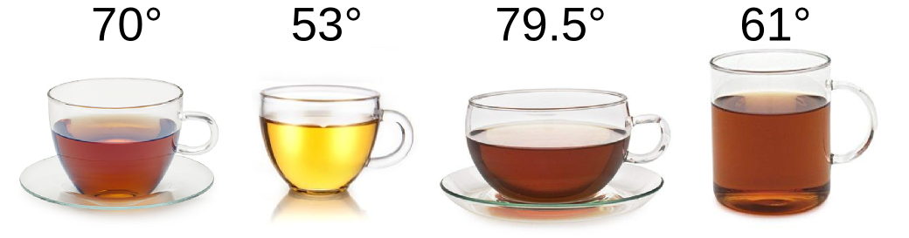
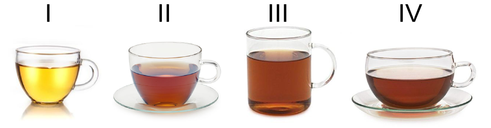
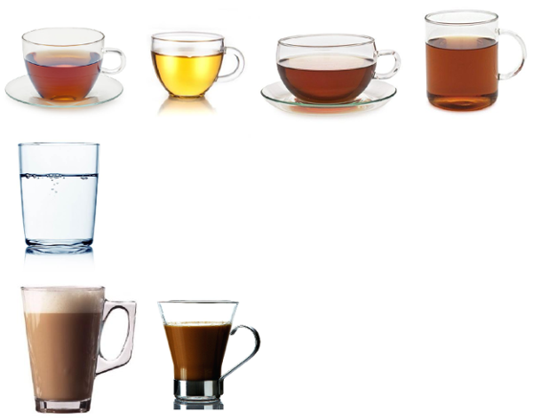
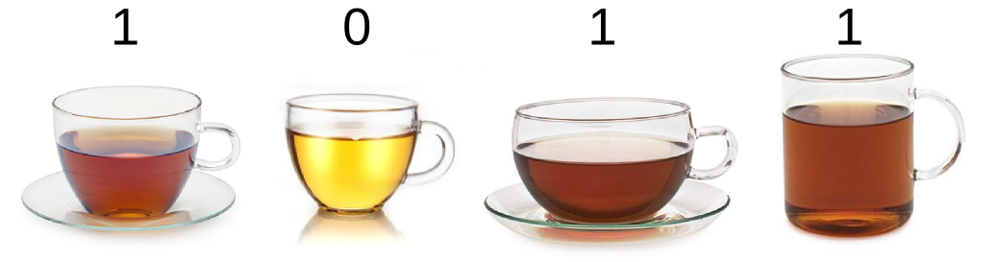

```{r setup, include = FALSE, cache = FALSE, purl = FALSE}
# output options
options(width = 70, scipen = 6, digits = 3)
library(knitr)
library(ggplot2)
library(gridExtra)
library(readxl)
# chunk default options
opts_chunk$set(fig.align='center', tidy = FALSE, fig.width = 7, fig.height = 3, warning = FALSE)
```

# Типы данных

## 1. Мерные = интервальные данные

<center>

</center>


### 1.1. Непрерывные 

Пример - температура чая в чашке.

Значения не лимитированы фиксированными вариантами и могут принимать любые значения. Чем точнее прибор, тем точнее данные.


### 1.2. Дискретные 

Пример - число чашек 

Эти переменные по своей природе могут принимать только фиксированные значения.


## 2. Ранжированные

Пример - субъективная оценка степени заварки чая:

I = так себе, II = средний, III = крепкий, IV = очень крепкий

<center>

</center>


Ранжированные данные похожи на непрерывные, но с потерей информации.

Допустим, мы не можем измерить объем чашек в миллилитрах, но можем оценить, в какую помещается больше всего, в какую - просто много, а в какую совсем мало. Мы можем расставить чашки по возрастанию объема и придать им номера - ранги - с которыми работать дальше.

Шаг между двумя соседними ранжированными величинами не обязательно одинаковый.


## 3. Категориальные = номинальные

<div class="columns-2">

<center>

</center>

</br>

</br>

</br>

</br>

</br>

Пример - тип напитка в чашке.

Сами по себе они очень слабо поддаются обработке, потому что не являютя и с большим трудом переводятся в числа. Но если посчитать частоту встречаемости, то получатся cчетные данные. 

<div/>


## 4. Бинарные

Пример - сахар в чае: где

1 = есть, 
0 = нет

<center>

</center>


Это информация о наличии/отсутствии признака.

Бинарные данные можно представить в виде логического вектора, то есть набора значений 0 и 1 или TRUE и FALSE.

Главная польза от бинарных данных в том, что в них можно перекодировать практически все остальные типы данных и применять специальные методы анализа.

# Инструменты

## Организация файлов курса

В течение курса вы будете аккумулировать файлы для работы.

Надо организовать их особым образом чтобы дальнейшая работа шла без проблем.

1. Создайте папку R_course где будут храниться ВСЕ материалы.

В эту папку помещайте пожалуйста ВСЕ файлы со скриптами

2. Внтури папки R_course создайте папку data

В нее помещайте все файлы с данными для анализа


## Скрипты и данные

https://varmara.github.io/glmintro/

Вкладка "Презентации и данные", День 1.

Ваши задачи:

### 1. скачать код к нашему занятию: 1.2_introduction_code.R

и сохранить его в папку R_course.

### 2. скачать файл с данными к занятию: 1.2_temperature.csv

и сохранить его в папку data ВНУТРИ папки R_course.


## RStudio. Первый запуск

Теперь ваша задча открыть файл скрипта

### 1.2_introduction_code.R

с помощью RStudio.


## RStudio. Первый запуск

Русские буквы выглядят как непонятные кракозябры? Нужно поменять кодировку.


File -> Reopen with Encoding

Из предложенного списка выберете UTF-8

В том же окне со списком поставьте галочку "Save as default encoding for source files"


## RStudio. Первый запуск


По умолчанию RStudio предлагает интерфейс из четырех окон:

- Source. Это простой текстовый редактор, где открывается один или несколько файлов для работы со скриптами.

- Console - командная строка, где "живет" R.
В консоль отправляются на выполнение команды, здесь же R выводит результаты и пишет сообщения об ошибках.

- Environment и History.

- File, Plots, Help и другие.

## RStudio

Я предлагаю на время курса всем настроить расположение окон одинаково: 

| Source        | Console |
|:-------------:|:-------:|
| Environment   | Plots   |

Сделать это можно войдя в меню Tools -> Global Options -> Pane layout

## Собственно R

Все что вы хотите чтобы R для вас сделал, нужно объяснять ему в виде команд. Если неясно, какая команда нужна для определенной операции, придется читать справочники.

Вам придется запомнить достаточно большое количество команд, готовьтесь. 
И как любой язык, R требует знания синтаксиса.

Сложности в работе обязательно будут, но не следует их бояться!

## Как выполнить команду?


### `Ctrl + Enter` 

Главное сочетание клавиш при работе в RStudio.

1. Чтобы выполнить всю строчку надо поставить курсор в любое место этой строки и нажать `Ctrl + Enter` 

2. Чтобы выполнить фрагмент строчки, надо выделить его и нажать `Ctrl + Enter` 

3. Чтобы выполнить несколько команд одну за другой, надо выделить несколько строк и нажать `Ctrl + Enter` 

## Как получить помощь

1. Поставить курсор на название функции и нажать `F1`

2. Перед названием функции можно напечатать знак вопроса и выполнить эту строку

3. Можно воспользоваться функцией `help()`

```{r eval=FALSE}
?help

# ИЛИ

help("help")
```

## Начало работы

R работает по принципу вопрос-ответ. Запущенная, программа ничего не делает и ожидает от вас команды. Вы набираете ее и отправляете в консоль. R что-то делает, выводит на экран результат, и переходит в режим ожидания следующей команды.

Знак `>` говорит, что программа готова принимать команды.

Знак `+` значит, что во введенной команде чего-то не хватает, и R ожидает продолжения. Один из самых частых случаев -- потерялась закрывающая скобка.

## Начало работы

Комментарии в тексте R-скрипта обозначаются символом '#'

```{r}
# это комментарии, они не будут выполняться
```

## R как калькулятор, математические операции

```{r}
2 + 2
1024 / 2
34 * 4
2 ^ 4
sqrt(27)
```


## R как калькулятор, математические операции

Многоуровневые конструкции:

```{r}
(10*(3-1))^-1
```

Ответ программы находится на следующей строчке после команды. Здесь он начинается с [1]. Это значит, что программа рассчитала единственное значение.

## Переменные

Оператор присваивания это символ стрелочки `<-`. Он работает справа налево:

`куда_записывать <- что_записывать`

Представим, что мы находимся в самом начале большого исследования чашек в нашей лаборатории, и пока только измерили температуру чая у себя в чашке.

Давайте создадим переменную `tea_1` и присвоим ей значение `70`:

```{r }
tea_1 <- 70
```

Чтобы увидеть содержимое переменной, достаточно позвать ее по имени:

```{r}
tea_1
```


### Как давать имена?

- Можно использовать только латинские буквы, цифры, нижнее подчеркивание и точку.

- Имена не должны содержать пробелов, начинаться с точки или цифры.

- R чувствителен к регистру, X и x — это разные имена

## Переменные

Нельзя давать объектам короткие, особенно однобуквенные, имена. Они могут быть уже заняты какой-то функцией, да и вы сами легко запутаетесь в таких переменных. Создавайте понятные и "говорящие" имена.

```{r purl=FALSE, echo=FALSE}
Варианты_названий <- c("a, 1_х, wing color", "var1, var_1", "shelllength", "shell_length, sp.count")
Качество <- c("плохо или недопустимо", "так себе, но допустимо", "хорошо, но трудно читать", "хорошо: информативно, легко читать")
kable(data.frame(Варианты_названий,Качество))
```

## Переменные

Ранее созданные переменные можно использовать в дальнейших рассчетах. 

Допустим, за 10 минут чай в чашке остывает на 10 градусов. Какова будет его новая температура?

```{r}
tea_2 <- tea_1 - 10
```

А на сколько градусов она уменьшится за 5 минут?

```{r}
(tea_1 - tea_2) / 2
```

## Способы создания векторов

Все переменные, что мы сейчас создали, представляют собой векторы одиночной длины.

C единственным значением бывает важно работать, но обычно данных у нас гораздо больше.

- Вектор можно сделать из нескольких значений вручную. Для этого есть команда `с()` от английского concatentate - собрать, склеить. Отдельные значения разделяются запятыми.

Мы обошли своих соседей, и шестеро из них пили чай. Мы измерили температуру и у них тоже, и теперь готовы создать более серьезную переменную

```{r}
tea_temp <- c(70, 64, 40, 91, 80, 83, 58)
```

- Команда `rep` повторяет одно и то же значение сколько угодно раз

```{r}
rep(-19, 4)
```

## Способы создания векторов

- Команда `seq` нужна для создания векторов, где значения следуют одно за другим без пропусков

```{r}
seq(1, 10) # от одного до 10
```

Почитайте help(seq) и самостоятельно создайте вектор чисел от -5 до 3 и с шагом 0.5


## Pешение

Функция принимает аргументы в таком порядке: `seq(от, до, шаг)`

```{r purl=FALSE}
seq(-5, 3, 0.5)
```

## Способы создания векторов

Можно стоить **многоуровневые конструкции**

```{r}
c(0, 2, rep(11, 5), -2, seq(51, 55, 2))
```

Векторы можно хранить в переменных для последующего использования

```{r}
vector_1 <- seq(-11, 12, 1)
vector_2 <- rep(0, 20)
```


## Адресация внутри векторов

При помощи оператора `[]`, можно обратится к некоторым элементам вектора. 
В квадратных скобках вам нужно указать один или несколько порядковых номеров элементов

```{r}
tea_temp[1] # первый элемент в векторе температур 
vector_1[10] # 10-й элемент в векторе vector_1
vector_1[22]
```

## Адресация внутри векторов

Если нам нужно несколько элементов, то их нужно передать квадратным скобкам в виде вектора. 

Какой результат даст команда:

```{r results="hide"}
vector_1[3:5]
```

А если задать вектор с номерами элементов при помощи функции `c()`

```{r}
vector_1[c(1, 10)]
vector_1[c(2, 4, 6)]
```

## Адресация внутри векторов

Что будет, если при обращении к вектору вы просто перечислили номера элементов через запятую?

```{r eval=FALSE}
vector_1[1, 3, 5]
```

Очень легко добавить в вектор значение, или объединить векторы. При этом не обязательно создавать новую переменную, можно и перезаписать старую. 

Допустим, мы измерили температуру в еще одной чашке. Наша выборка растет! Чтобы перезаписать переменную `tea_temp` нужно склеить старые значения с новыми и присвоить их переменной со старым именем:

```{r}
tea_temp <- c(tea_temp, 88)
```

## Операции в векторами

Узнаем количество значений:

```{r}
length(vector_1)
```

Сумма всех элементов вектора

```{r}
sum(vector_1)
```

Сумма разных векторов

```{r}
sum(vector_1, vector_2)
```

## Операции в векторами

Математические операции

```{r}
vector_1 + 2
vector_1 * 2
vector_1 ^2
```

## Другие типы данных в R

Кроме числовых, бывают и другие типы данных:

### Текстовые данные

Каждый текстовый элемент (string) должен быть окружен кавычками

```{r}
"это текст"
```

Текстовые значения можно объединять:

```{r}
season<-c("winter","spring","winter","winter","spring",
          "spring","summer","summer","summer")
```

## Другие типы данных в R

### Логические данные

```{r}
TRUE # истина
FALSE # ложь
```

Можно сокращать:

```{r}
summer <- c(F, F, F, F, F, F, T, T, T)
summer
```

Что мы получим, выполнив такую команду:

```{r results="hide"}
winter <- season == "winter"
```


## Как узнать тип данных в переменной?

Чтобы узнать, что за данные хранятся в переменной, используйте функцию `str()`

```{r}
str(vector_1)
str(season)
str(winter)
```

## Пропущенные значения

Не существует ни идельных наблюдений, ни идеальных экспериментов. Чем больше массив данных, тем больше вероятность встретить пропущенные данные. Они бывают нескольких типов.

**Unknown**, неизвестное значение. Измерение было не получено, не записано, или потеряно. Скажем, мы измеряли температуру чая в 20 чашках, отвернулись на минуту, и проходящий мимо коллега унес и выпил одну из них.

**Not applicable**, неприменимое значение. Мы обнаружили нечто, логически несовместимое с признаком, который надо фиксировать. Например, нам попалась чашка, полная земли, и в ней рос кактус!

И тот и другой варианты отличается по смыслу от нуля.

Возьмем пример с чашками чая. Ноль в качестве значения для нашей выпитой чашки будет означать, буквально, что в ней находился тающий снег. Это неверно отражает ситуацию, да еще и исковеркает нам последующий анализ.

## Пропущенные значения

Обойтись без пропущенных данных практически невозможно, поэтому важно выделять им места.

Пропущенное значение записывается как **NA** т.е. Not Available.

Вставим NA (допустим, из унесенной чашки) в вектор температур:

```{r}
tea_temp <- c(tea_temp, NA)
```

Посмотреть, какие значения в векторе неопределены можно командой

```{r}
is.na(tea_temp)
```

Проверьте, есть ли пропущенные значения в векторе `vector_2`

## Пропущенные значения

Многие команды, при работе с пропущенными значениями, будут выводить результат NA:

```{r}
sum(tea_temp)
```

Чтобы узнать, почему и как это исправить - посмотрите в `help("sum")`. 
Выяснится, что у функции `sum()` есть аргумент `na.rm`, который по умолчанию принимает значение `FALSE`, то есть `NA` не учитываются при подсчете суммы.

Если мы передадим функции `sum` аргумент `na.rm = TRUE`, то получится правильная сумма

```{r}
sum(tea_temp, na.rm = TRUE)
```

## Работа с внешними данными

Работа в RStudio предполагает два сорта внешних источников: текстовые файлы со скриптами (например 1.1_intro_to_R_code.R который у вас сейчас открыт) и файлы с данными.

Рекомендуется запускать R из той же директории, где находятся файл со скриптом. 

В R очень легко идти по дереву каталогов вниз, поэтому удобно иметь внутри рабочей директории со скриптом отдельную папку с таблицами данных. 


На минутку сверните RStudio и удостоверьтесь, что у вас есть одна папка, в которой находятся файлы скриптов с расширением .R, и **внутри** - папка data содержащая таблицы данных.


## Устанавливаем рабочую директорию

Проверим, где мы сейчас находимся

```{r}
getwd()
```

Допустим, это не та папка, которая нужна.

Под Linux`ом можно прописать путь целиком:

`setwd("/home/shade/Documents/WORK/2017_field_data/Baltic_Sea")`

Но есть способ проще:
 
Выберите в меню `Session -> Set working Directory... -> To Source File Location`


## Импорт данных

Два самых популярных типа файлов для импорта данных в R это .cvs и .xls

Как организовать свои данные чтобы избежать мучительных переделываний и исправлений?

- никаких пустых ячеек! 

- никаких русских букв

- равное количество значений во всех строках

- в идеале должно быть всего две колонки: значение признака и результат измерения

- правила для названий переменных те же что в R. Главное - никаких пробелов

- десятичная часть отделена точкой а не запятой


## Импорт данных: csv

Формат csv черезвычайно хорош, поскольку в Excel или OpenOffice откроется как привычная глазу таблица. В то же время, это просто особым образом размеченный текстовый файл. Его можно и открыть в блокноте, и с легкостью загрузить в R.

Так как это по сути текст, клеточки таблицы передаются с помощью разделителей. Самые распространенные варианты: табуляция, точка с запятой, это хорошие варианты, а так же запятая и пробел - плохие.

Если будете создавать csv файлы, старайтесь использовать один из хороших вариантов.

После того как данные внесены и отформатированы, в R их загружает команда `read.table("имя файла", sep=";", header=T)`

Первый аргумент - имя файла, оно указывается в кавычках

`sep` указывает разделитель. По умолчанию это пробел или табуляция, но можно записать и другое значение

Аргумент `header` определяет судьбу названий столбцов. По умолчанию его значение FALSE. Чтобы названия были прочитаны и стали именами переменных, нужно указать TRUE.

## Импорт данных: csv

Прочитаем файл с температурами "1.2_temperature.csv" находящийся в папке "data". Это вымышленные данные о температуре и типе напитков, обнаруженных нами в чашках наших коллег в течение года.

```{r}
TEMP <- read.table("data/1.2_temperature.csv", header=T)
```

Посмотрим на несколько начальных строк:

```{r}
head(TEMP)
```

Как видим, все три переменные и их названия на месте.

## Индексация таблицы данных

Для дальнейшей работы с таблицей данных нам пригодятся три команды: две для индексации и одна - для извлечения фрагментов массива данных.

### Значок доллара `$`

`где_искать$что_искать` т.е. `название_массива$название_переменной`


```{r}
TEMP$season
```

## Индексация таблицы данных

### Квадратные скобки `x[i]`

Чтобы найти все значения переменной, отвечающие какому-то условию, мы должны создать двухуровневую конструкцию. Например, нас интересует температура напитков весной.

Сначала сконструируем х: обратимся к переменной `TEMP$temperature`

Затем i: обратимся к переменной `TEMP$season` и укажем, что нас интересуют значения `TEMP$season == "spring"`

```{r}
TEMP$temperature[TEMP$season == "spring"]
```

## Фрагмент таблицы данных

Аналогичную операцию можно проделать с помощью команды 'subset'. Отличие же заключается в том, что вместо вектора значений одной переменной, мы получаем маленький, но настоящий, массив данных.

Попробуйте сами получить фрагмент таблицы, включающий все данные относящиеся к кофе.

## Решение

```{r purl=FALSE}
subset(TEMP, drink == "coffee")
```

# Напоследок

## Установка пакетов

Пакеты в R устанавливать очень просто - при условии что вы занете как они называются. Набираем команду:

`install.packages("имя_пакета")`

Установка происходит раз и навсегда. Но не каждый раз нам нужен именно этот пакет. Поэтому по умолчанию они не загружаются. 

Чтобы использовать пакет в текущей сессии, загружаем его из библиотеки:

`library(имя_пакета)`

При установке название пакета должно быть в кавычках, при загрузке - без кавычек.

