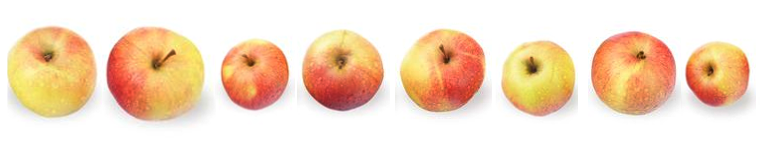
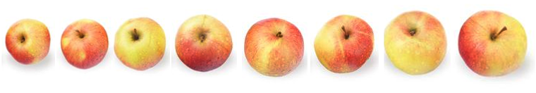
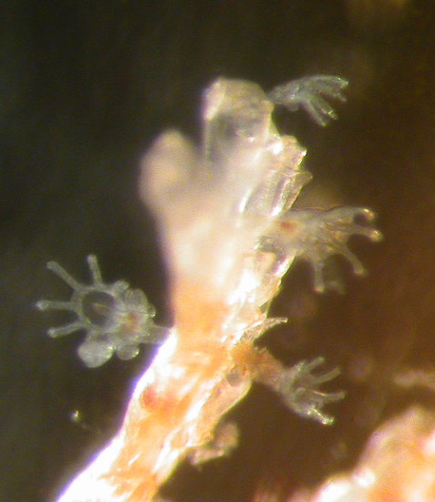
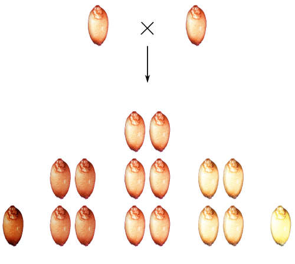

```{r setup, include = FALSE, cache = FALSE, purl = FALSE}
# output options
options(width = 70, scipen = 6, digits = 3)
library(knitr)
library(ggplot2)
library(gridExtra)
# chunk default options
opts_chunk$set(fig.align='center', tidy = FALSE, fig.width = 7, fig.height = 3, warning = FALSE)
```

# ЧАСТЬ 1. Характеризуем данные

## Интуитивно

<center>

</center>

Например, анализаируя каждое значение в выборке по мере поступления.

## Через связки описательных статистик

### Statistics of location / Центральные тенденции

### Statistics of dispersion / Меры разброса

# ЧАСТЬ 2. Cвязка медиана + квантили; 5-number summary.

## Медиана

Если мы отранжируем наши измерения, то медиана будет тем значением, которое окажется в середине ряда, так, что слева и справа будет равное число измерений. Сами значения не столь важны, как их местоположение в ряду, т.е. их ранг.

Если число измерений нечетное, то медиана и есть значение с индексом $\frac{n+1}{2}$ в ранжированном ряду.

Если измерений четное число, то медиана окажется посередине между $\frac{n}{2}$ и $\frac{n+1}{2}$ значениями.

## Медиана

Предположим, мы занимаемся селекцией яблонь и хотим охарактеризовать урожай нашей любимой яблони, на которую мы возлагаем большие надежды. Симулируем данные измерения диаметров яблок.

```{r}
set.seed(14)
apples <- rnorm(10, 8, 1) #Возьмем десять случайных
                          #значений из нормального распределения
apples <- round(apples,1) #Перезапишем вектор, округлив измерения
                          #до первого знака после запятой
apples
```

## Медиана


Чтобы получить медиану, мы должны ранжировать, или отсортировать, наш вектор по возрастанию:

```{r}
sort(apples)
```


<div class="columns-2">

<center>




</center>

<div/>

## Медиана


```{r}
sort(apples)
```

Медиана находится в промежутке между значениями 9.0 и 9.1. В таких случаях принято вычислять среднее от этих двух значений, т.е. 9.05

Проверим себя: 

```{r}
median(apples)
```

## Медиана: устойчивость к выбросам

Медиана обладает черезвычайно приятным свойством – так называемой устойчивостью (robustness).

Представим, что наше распределение пострадало от неаккуратности. Допустим сотрудник, которому мы поручили измерять яблоки, измерил также диаметр арбуза и записал этот результат вместе со всеми остальными.

```{r}
apples2 <- c(apples, 68) #Создадим вектор с новым значением
sort(apples2)
```

Медиана теперь равна 9.1

```{r}
median(apples2)
```


## Медиана: устойчивость к выбросам

Давайте для сравнения посмотрим на среднюю.

```{r}
mean(apples)
mean(apples2)
```

Как видим, она не так благополучно пережила это вторжение. Единственное неверное измерение сбило ее из разряда довольно крупных яблок в область гигантских грейпфрутов.

## Квантили

Квантили делят распределение на четыре равные части, каждая из которых включает по 25% значений.

I квантиль отсекает как раз 25%.
II - 50%. Это ни что иное, как медиана.
III квантиль отсекает 75% значений. 

Определим их с помощью команды `quantile`

```{r}
quantile(apples)
```

Нам показали так же минимумальную и максимальную величины.

## 5-number summary

Аналогичные значения, только со средней в качестве бесплатного приложения, возвращает и функция `summary`:

```{r}
summary(apples)
summary(apples2)
```

## Персентили

Так же как медиана это частный случай квантиля, так и сам квантиль - частный случай персентиля.

Ничто не помешает нам узнать, например, какие значения отсекают 10% или 99% значений выборки. Подставим соответствующие агрументы:

```{r}
quantile(apples, probs = c(0.1, 0.99))
```

## Боксплот: 5-number summary на графике

<div class="columns-2">
Отложим числа, характеризующие выборку, по оси Y:

- жирная линия в центре это медиана,

- нижняя и верхняя границы "коробочки" это I и III квантили,

- усы достигают минимального и максимального значений.

Если в выборке присутствуют выбросы, то они будут изображены отдельными точками. 


```{r boxplot.plain.1, fig.height = 6.5, fig.width = 4}
boxplot(apples)
```
</div>

## Case study: диатомовые водоросли в желудках фильтраторов. Самостоятельная работа.

<div class="columns-2">

В морских сообществах встречаются два вида фильтраторов, один из которых любит селиться прямо на поверхности тела другого.

*Tegella armifera* это вид-хозяин. Он может жить как сам по себе, так и вместе с симбионтом.

*Loxosomella nordgardi* - вид-симбионт. Он практически никогда не встречается в одиночестве. 


</div>

## Case study: диатомовые водоросли в желудках фильтраторов.

В файле `data\2.1_diatome_count.csv` даны количества диатомовых водорослей в желудках этих животных. Прочитаем эти данные и посмотрим на их структуру:

```{r}
diatoms <- read.table("data/2.1_diatome_count.csv", 
                      header = T, sep = "")
head(diatoms)
```

Одна строчка в таблице соответствует одному животному, колонки - видам.

Ваша задача дать комплексную характеристику всем трем выборкам и построить боксплоты.


## Решение
```{r boxplot.plain.diatoms, purl=FALSE, fig.height = 3}
summary(diatoms)
boxplot(diatoms)
```

## Боксплоты в ggplot2

Чтобы нарисовать боксплоты в ggplot2 нужен другой формат данных.

```{r}
diatoms2 <- stack(diatoms)
#Новые переменные теперь называются values и ind. Переименуем:
names(diatoms2) <- c("count", "sp")

```

Теперь у нас не три, а две переменных: `count` включает все измерения числа водорослей, а `sp` отмечает в чьих желудках они найдены.

```{r}
head(diatoms2)
```

## Боксплоты в ggplot2

Можно строить график:

```{r boxplot.ggplot.diatoms, fig.height = 4.5}
library("ggplot2")
ggplot(data = diatoms2, aes(y = count, x = sp)) + geom_boxplot()
```

## Квантили и боксплот: непараметрические характеристики выборки

Главный плюс, но так же и минус связки медианна + квантили это ее независимость от формы распределения.

Будь оно симметричным или с хвостом, 5-number summary опишет, а боксплот нарисует его без искажений. Однако, далеко на этих характеристиках не уедешь.

Бывают случаи, когда можно применять более специальные, но и более информативные характеристики.

# ЧАСТЬ 3. Нормальное распределение

## Все распределения равны, но некоторые равнее

Это непрерывное распределение, получаемое из мерных данных. Однако, многие распределения других типов тоже могут приближаться к нормальному.

```{r ND.1, echo=FALSE, purl=FALSE, fig.width=5.5, fig.height = 5, warning=FALSE}
library (ggplot2)
theme_set(theme_bw(base_size = 14))
Mu <- 10
Sigma <- 2
x <- seq(from = 0, to = 20, by = 0.1)
y <- dnorm(x = x, mean = Mu, sd = Sigma)
Norm <- data.frame(x, y)
ND_curve <- ggplot(data = Norm, aes(x=x, y=y)) +
  geom_line(color="steelblue", size=2) + 
#  geom_vline (xintercept = Mu) + 
  labs(x = "Values", y = "Probability")
ND_hist <- ggplot(data = Norm, aes(x=x, y=y)) +
  geom_bar(stat = "identity", width = .05) +
#  geom_vline (xintercept = Mu) + 
  labs(x = "Values", y = "Relative frequency")
ND_curve
```

## Относительная частота и плотность вероятности

<div class=columns-2>

```{r ND.2, echo=FALSE, purl=FALSE, fig.width=4, fig.height = 6, warning=FALSE}
ND_curve2 <- ND_curve + geom_vline(xintercept = 12, linetype="dotted", color = "red") + geom_vline(xintercept = 14, linetype="dotted", color = "red")
ND_hist2 <- ND_hist + geom_vline(xintercept = 12, linetype="dotted", color = "red") + geom_vline(xintercept = 14, linetype="dotted", color = "red")
grid.arrange(ND_hist2, ND_curve2, ncol = 1)
```

На оси Y может быть отложена относительная частота значений Х в эмпирическом распределении, или вероятность получить такие значения из теоретического распределения.

На оси Х отложены значения Х в интервале от 0 до 20, в действительности же кривая простирается от $-\infty$ до $+\infty$

Площадь под кривой = 1.  Интегрируя кривую на промежутке $(k,..,l)$, можно узнать вероятность встречи значений $(x_k,...x_l)$.

НО! Нельзя расчитать вероятность одного значения $X = x_k$, так как это точка, и под ней нет площади.


<div/>

## Условия появления нормально распределенных признаков

<div class=columns-2>

- Множество факторов

- Наличие/отсутствие каждого фактора не зависит от остальных

- Эффекты факторов аддитивны и независимы

- Вклад каждого фактора в итоговую изменчиость одинаков

Что-то напоминает, не правда ли?

<center>

</center>
<div/>

## Приятные особенности

Нормальных кривых бесконечно много, и их описывает заковыристая формула с двумя параметрами. Достаточно знать эти два значения чтобы восстановить или смоделировать любое нормальное распределение.

Если:

- данные в выборке распределены нормально
- мы можем узнать или оценить параметры этого распределения

можно считать что выборка у нас в кармане! Нам больше не нужно знать результаты измерений, чтобы строить предположения о природе данных.

Так что же это за чудодейственные параметры? Средняя и стандартное отклонение конечно!

# ЧАСТЬ 4. Связка среднее + стандартное отклонение

## Центральная тенденция

### Арифметическое среднее

Формула

$$\bar{x}=\frac{\sum{x_i}}{n}$$

Рассчитаем вручную и проверим:

```{r}
mean_apple_diam <- sum(apples) / length(apples)
mean_apple_diam
round(mean_apple_diam,3) == round(mean(apples),3)
```

## Меры разброса

### Девиата (отклонение)

Первым кирпичиком в построении параметрических мер разброса будет разность между значением вариаты (измерения) и средней:

$$x_i - \bar{x}$$

```{r}
raw.deviates <- c(apples - mean(apples))
raw.deviates
```
 
Как теперь из этого вектора значений получить одну числовую характеристику?

## Меры разброса

К сожалению мы не можем просто сложить все значения девиат и поделить их на объем выборки. Cумма девиат всегда будет равна нулю.

```{r}
round(sum(raw.deviates))
```

### Путь 1: среднее отклонение = Average Deviation

Первый выход, который бросатется в глаза, это использовать абсолютные значения

$$AD = \frac{\sum{\lvert x_i - \bar{x} \rvert}}{n}$$

```{r results="hide"}
sum(abs(raw.deviates)) / length(apples)
```

## Меры разброса

### Путь 2: сумма квадратов = SS, Sum of Squares

Избавиться от знака девиаты можно не только с помощью модуля, но и возведя значение в квадрат.

$$SS = \sum{{(x_i - \bar{x})}^2}$$

```{r results="hide"}
sum((raw.deviates)^2)
```

## Меры разброса

### Дисперсия = MS, Mean Square, Variance

Если мы теперь поделим сумму квадратов на объем выборки, то получим дисперсию.

$$variance=\frac{\sum{(x_i - \bar{x})^2}}{n}= \frac{SS}{n}$$

```{r results="hide"}
sum((raw.deviates)^2) / length(apples)
```

### Среднеквадратичное/стандартное отклонение = Standard Deviation

Квадратный корень из дисперсии позволит вернуться к исходным единицам измерения

$$SD=\sqrt{\frac{\sum{(x_i - \bar{x})^2}}{n}} = \sqrt{variance}$$

```{r results="hide"}
sqrt(sum((raw.deviates)^2) / length(apples))
```

## Особенности применения связки

- только вместе,

- чувствительны к выбросам,

- плохо работают с несимметричными распределениями.


## Задания

### 1. Из пяти положительных чисел создайте выборку со средней = 10 и медианой = 7

### 2. Из чисел от 0 до 20 (можно с повторами) создайте две выборки: с минимальным и максимальным стандартным отклонением. Объем выборки тот же, 5 значений.


## Решение 1

В выборке с медианой = 7 и n = 5, мы точно знаем: (а) одно из значений должно быть равно 7, (б) два значения должны быть меньше, и два - больше 7. 

Создадим вектор, в котором одно значение задано, а три других просто придумаем:

```{r purl=FALSE}
example <- c(2, 5, 7, 10)
```

Среднее это сумма всех значений вборки, поделенная на ее объем. Умножив среднюю на 5 получим сумму всех значений.

Определим недостающее и проверим себя:

```{r purl=FALSE}
10 * 5 - sum(example)
example <- c(2, 5, 7, 10, 26) #перезапишем вектор
mean(example)
```

## Решение 2

Минимальное стандартное отклонение будет в выборке, состоящей из одинаковых значений. Любое число от 0 до 20 подойдет.

```{r purl=FALSE}
min1 <- rep(19, 5)
sd(min1)
```

## Решение 2

Максимальный разброс получится если использовать значения на противоположных краях интервала. Создадим разные варианты выборок:

```{r purl=FALSE}
max1<-c(0,0,10,20,20)
max2<-c(0,0,0,20,20)
max3<-c(0,0,0,0,20)
```

```{r purl=FALSE}
sd(max1)
sd(max2)
sd(max3)
```

Вектор `max2` дал наилучший результат.

# ЧАСТЬ 5. От статистик к параметрам.

## Выборка и генеральная совокупность

*Статистики* описывают выборки. Их обозначают латинскими буквами: $М$, $s^2$.

*Параметры* описывают генеральную совокупность. Их обозначают греческими буквами: $\mu$, $\sigma^2$

С помощью выборочных статистик мы стремимся описать популяционные параметры.

## Степени свободы в стандартном отклонении

Среднеквадратичное отклонение, которое мы только что сконструировали, верно описывает выборку, но не годится для генеральной совокупности, так как недооценивает ее истинное разнообразие. Чтобы это исправить, в знаменатель нужно внести поправку, из объема выборки превратить его в степень свободы.

Сумма "сырых" девиат всегда равна нулю, поэтому зная n-1 значений, мы без труда рассчитаем каким должно быть последнее. А значит, оно не может варьировать "свободно".

### Дисперсия (выборочная оценка параметра)

$$\sigma^2=\frac{\sum{(x_i - \bar{x})^2}}{n-1}$$

### Стандартное отклонение (выборочная оценка параметра)

$$\sigma=\sqrt{\frac{\sum{(x_i - \bar{x})^2}}{n-1}}$$

## Степени свободы в стандартном отклонении

Давайте проверим как работают степени свободы на примере.

Cоздадим простейшую выборку со следующими признаками:

```{r}
sim.mean <- 100
sim.sd <- 2
sim.n <- 11
```

Сначала рассчитаем дисперсию и сумму квадратов

```{r}
sim.var <- sim.sd^2
sim.ss <- sim.var * (sim.n - 1)
```

SD = 2 это маленький разброс, так что надо выбирать значения недалеко от среднего. Например, 101 - очень удобное число. Заполним ими нашу выборку почти до конца:

```{r}
sim.sample <- rep(101,10)
```

## Степени свободы в стандартном отклонении

Итак, 10 значений мы взяли практически с потолка. Последнее, одиннадцатое, должно быть предсказано, иначе наша затея не сработает, и выборка с желаемыми признаками не получится.

Рассчитаем значение суммы квадратов для уже созданных нами "свободных" вариат:

```{r}
free.ss <- (10) * ((101-100)^2)
free.ss
```

Из общей суммы квадратов вычтем уже имеющуюся:

```{r}
determined.ss <- sim.ss - free.ss
```

Определим значение одиннадцатой девиаты, т.е. расстояние от среднего до последнего значения в выборке.

```{r}
sqrt(determined.ss)
```

## Степени свободы в стандартном отклонении

10 предыдущих значений были больше среднего, значит последнее должно быть меньше, иначе выборка не уравновесится

```{r}
last.value <- 100 - sqrt(determined.ss)
last.value
```

Добавим последнее, "детерминированное", значение к остальным:

```{r}
sim.sample <- c(rep(101,10), last.value)
sim.sample
```

Можем теперь проверить себя:

```{r}
round(mean(sim.sample))
round(sd(sim.sample))
```

## Ошибка среднего, SEM

Имея дело с выборками и стремясь распространить то, что мы узнали, на всю генеральную совокупность, исследователю к лицу некоторая скромность.

Наша выборка - лишь одна из множества возможных выборок, берущих начало из одной генеральной совокупности. Значения попадают в выборки случайно, апотому не одинаковыми будут и итоговые выборочные статистики.

Каждая из них, хотя и будет описывать популяционный параметр, имеет шанс быть неверной. 

## Модель генеральной совокупности

Давайте для наших экспериментов создадим генеральную совокупность с параметрами $\mu = 50$ и $\sigma = 7$.

Вот график ее частотного распределения.

```{r echo=FALSE, purl=FALSE, warning=FALSE}
set.seed(38)
X <- rnorm(n = 10000, mean = 50, sd = 7) # создаем вектор из 10000 значений нормально распределенной величины
Mu <- mean(X)
gg_population <- ggplot(data = data.frame(X), aes(x = X)) + geom_histogram(binwidth = 2, fill = "steelblue", color = "black") + labs(title = "Population") + xlim(30, 70) + geom_vline(xintercept = Mu, colour = "red", size = 1) 
gg_population
```

## Возьмем выборку из этой генеральной совокупности

```{r echo=FALSE, purl=FALSE, warning=FALSE}
i_1 <- sample(x = 10000, 30)
sample_1 <- X[i_1]
Mu_1 <- mean(sample_1)
gg_sample_1 <- ggplot(data = data.frame(X = sample_1), aes(x = X)) + geom_histogram(binwidth = 1, fill = "steelblue", color = "black") + labs(title = "Sample 1") + xlim(30, 70) + geom_vline(xintercept = Mu, colour = "red", size = 1) + geom_vline(xintercept = Mu_1, colour = "red", size = 1, linetype = "dashed")
gg_sample_1
# mean(sample_1)
# sd(sample_1)
```

## В разных выборках средние значения будут отличаться.

```{r echo=FALSE, purl=FALSE, fig.height=5.5, warning=FALSE}
i_2 <- sample(x = 10000, 30)
sample_2 <- X[i_2]
Mu_2 <- mean(sample_2)
gg_sample_2 <- ggplot(data = data.frame(X = sample_2), aes(x = X)) + geom_histogram(binwidth = 1, fill = "steelblue", color = "black") + labs(title = "Sample 2") + xlim(30, 70) + geom_vline(xintercept = Mu, colour = "red", size = 1) + geom_vline(xintercept = Mu_2, colour = "red", size = 1, linetype = "dashed")

i_3 <- sample(x = 10000, 30)
sample_3 <- X[i_3]
Mu_3 <- mean(sample_3)
gg_sample_3 <- ggplot(data = data.frame(X = sample_3), aes(x = X)) + geom_histogram(binwidth = 1, fill = "steelblue", color = "black") + labs(title = "Sample 3") + xlim(30, 70) + geom_vline(xintercept = Mu, colour = "red", size = 1) + geom_vline(xintercept = Mu_2, colour = "red", size = 1, linetype = "dashed")

library(gridExtra)
grid.arrange(gg_sample_1, gg_sample_2, gg_sample_3, ncol = 1, heights = c(1, 1, 1))
```

## Что будет со средними, если взять много выборок?

Давайте возьмем много-много выборок, вычислим для каждой выборочное среднее и построим распределение этих выборочных средних.

```{r echo=FALSE, purl=FALSE}
# Создаем пустой вектор для записи средних
my_means <- rep(NA, 100)
# Цикл
for (smpl in 1:100) {
  i <- sample(x = 10000, size = 5)
  mu_i <- mean(X[i])
  my_means[smpl] <- mu_i
}
# length(my_means)
# head(my_means)
```

**Выборочные средние нормально распределены с параметрами** $\mu$ и $SD _\bar{x}$

**Среднее значение выборочных средних стремится к среднему в генеральной совокупности**

```{r echo=FALSE, purl=FALSE, warning=FALSE}
gg_means <- ggplot(data = data.frame(means = my_means), aes(x = means)) + geom_histogram(binwidth=1, fill="orangered", color="black") + labs(title = "100 sample means, N = 5") + xlim(30, 70) + geom_vline(xintercept = Mu, colour = "red", size = 1) + geom_vline(xintercept = mean(my_means), colour = "red", size = 1, linetype = "dashed")
gg_means
```

## Чем больше объем выборок, тем точнее оценка среднего в генеральной совокупности

$$SE _\bar{x} = \sigma / \sqrt{N}$$

<div class=columns-2>

```{r echo=FALSE, purl=FALSE, fig.width=4, fig.height=5, warning=FALSE}
# Создаем пустой вектор для записи средних
my_means_30 <- rep(NA, 100)
# Цикл
for (smpl in 1:100) {
  i <- sample(x = 10000, size = 30)
  mu_i <- mean(X[i])
  my_means_30[smpl] <- mu_i
}
gg_means_30 <- ggplot(data = data.frame(means = my_means_30), aes(x = means)) + geom_histogram(binwidth=1, fill="orangered", color="black") + labs(title = "100 sample means, N = 30") + xlim(30, 70) + geom_vline(xintercept = Mu, colour = "red", size = 1) + geom_vline(xintercept = mean(my_means_30), colour = "red", size = 1, linetype = "dashed")
grid.arrange(gg_population, gg_means, gg_means_30, ncol = 1)
```

SEM, Cтандартная ошибка среднего (= стандартное отклонение выборочного распределения среднего) будет в N раз меньше, чем дисперсия в генеральной совокупности 

То есть, чем больше будет объем выборок, тем меньше будет эта стандартная ошибка, и тем точнее мы оценим (параметрическое) среднее в генеральной совокупности.

<div/>


## SD vs SE

Выборку должны характеризовать центральная тенденция (средняя) и мера разброса.

Стандартное отклонение, описывающее непосредственно выборку, т.е. отличия значений от выборочного среднего, характеризует разброс в выборке напрямую, а значит является более хорошей описательной статистикой, чем стандартное отклонение (=стандартная ошибка) среднего.

Поэтому лучше характеризовать данные в формате

$$Mean \pm SD (N)$$

а не

$$Mean \pm SE (N)$$


## Take home messages

> - Описательные статистики ходят только в связке.
> - Выбирая между медианой и средней, учитывайте природу данных.
