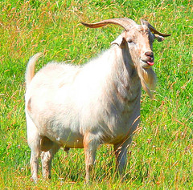

```{r setup, include = FALSE, cache = FALSE, purl = FALSE}
# output options
options(width = 70, scipen = 6, digits = 3)
library(knitr)
# chunk default options
opts_chunk$set(fig.align='center', tidy = FALSE, fig.width = 7, fig.height = 3, warning = FALSE)
```

## Мы рассмотрим

+ Линейные модели c непрерывными и дискретными предикторами
+ Взаимодействие дискретных и непрерывных предикторов

##Влияет ли стаж работы на предприятиях, вырабатывающих кадмий, на жизненнй объем легких?

Прмер взят из книги:
P. Armitage and G. Berry (1987), Statistical Methods in Medical Research, 2nd ed., Blackwell, p.286.

Данные представленны в пакете `ISwR`

Переменные:

`group` - Группа 1: Более 10 лет в отрасли, контактирующие с кадмием; Группа 3 -  не подвергались воздействию.

`age` - возраст

`vital.capacity` - объем легких (л).

## Загружаем данные

```{r}
vit <- read.table("data/vitcap2.csv", header = TRUE, sep = ";")
```


##Немного преобразуем исходный датасет

```{r}
vit$Group [vit$group == 1] <- "Long exposed"
vit$Group [vit$group == 2] <- "Short exposed"
vit$Group [vit$group == 3] <- "Not exposed"

```


##Вычисляем средние

```{r}
library(dplyr)
vit_summary <- vit %>%  group_by(Group) %>%  #Передаем датафрейм группирующей функции
            summarise(mean_capac = mean(vital.capacity),  # Вычисляем среднюю
            mean_capac = sd(vital.capacity), # Стандартное отклонение
            n_capac = n(),  # объем выборки
            SE_capac = sd(vital.capacity)/sqrt(n())) # Стандартную ошибку

vit_summary
```

## Меняем порядок уровней
```{r}
vit_summary$Group <- factor(vit_summary$Group, levels = c("Not exposed", "Short exposed", "Long exposed"))

levels(vit_summary$Group)
```


##Визуализируем результаты

```{r}
library(ggplot2)
ggplot(vit_summary, aes(x = Group, y = mean_capac)) +  geom_bar(stat = "identity", aes(fill = Group)) + geom_errorbar(aes(ymin = mean_capac - SE_capac, ymax = mean_capac + SE_capac), width = 0.2)

```

## Модели с дискретными предикторами

```{r , echo=FALSE}
set.seed(1234)
x <- data.frame(labels = c(rep("Level 1", 10), rep( "Level 2", 10), rep("Level 3", 10)), response = c(rnorm(10, 5, 1), rnorm(10, 10, 1), rnorm(10, 15, 1))) 

ggplot(x, aes(x=labels, y=response)) + geom_boxplot()+ geom_point(color="blue", size=4) + xlab(" ") 

```

Модель для данного примера имеет такой вид  
<br>
<br>
$response = 4.6 + 5.3I_{Level2} + 9.9 I_{Level3} + \epsilon_i$

$I_{i}$ - dummy variable   

Моделями с дискретными предикторами занимается классический **дисперсионный анализ**

## Переменные-болванки (dummy variables)

Для понимания сути переменных-болванок полезно понимать более глубинные основы метода линейных моделей

##Скрытая от глаз техника вычислений

Для обычной модели с непрерывным предиктором каждое предсказанное значение вычисляется по следующей формуле $ y_i = b_0 + b_1  x_i$
$$
y_1 = b_0 + b_1  x_1  \\ 
y_2 = b_0 + b_1  x_2 \\
y_3 = b_0 + b_1  x_3 \\
... \\
y_n = b_0 + b_1  x_n
$$

##Скрытая от глаз техника вычислений
Длинный ряд вычислений можно записать короче

$$
\textbf{y} = \textbf{X} \boldsymbol{\beta} 
$$

Здесь 
$\textbf{y}$ - Вектор предсказанных значений
$\boldsymbol{\beta}$ - вектор коэффициентов линейной модели
$\textbf{X}$ - Модельная матрица


# ANCOVA на примере данных об активности пуромицина

## Пример: Пуромицин

Пуромицин - антибиотик пуронового ряда, ингибитор синтеза белков.
Эти данные --- о том, как меняется активность фермента галактозил трансферазы под воздействием пуромицина (Treloar 1974). Измеряли скорость реакции в зависимости от концентрации субстрата на мембранах аппарата Гольджи из богатых мембранами фракций из печени крыс.

- `conc` --- концентрация пуромицина
- `rate` --- скорость химичемской реакции
- `state` --- индикатор того, обработаны ли клетки пуромицином

```{r}
data("Puromycin") # данные, встроенные в R
head(Puromycin)
```

## Знакомимся с данными

```{r}
sapply(Puromycin, class)
colSums(is.na(Puromycin))
nrow(Puromycin)
table(Puromycin$state)
```

## Задание

Постройте график зависимости скорости химической реакции от концентрации

## Решение


На самом деле, зависимость скорости химической реакции от концентрации нелинейна, но мы попробуем использовать трансформацию

```{r purl=FALSE, eval=FALSE}
library(ggplot2)
ggplot(Puromycin, aes(x = conc, y = rate, colour = state)) +
  geom_point()
ggplot(Puromycin, aes(x = log(conc), y = rate, colour = state)) +
  geom_point()
```

```{r gg-transformation, purl=FALSE, eval=TRUE, fig.width=10, echo=FALSE}
library(ggplot2)
library(gridExtra)
grid.arrange(
ggplot(Puromycin, aes(x = conc, y = rate, colour = state)) + geom_point(),
ggplot(Puromycin, aes(x = log(conc), y = rate, colour = state)) + geom_point(),
ncol = 2)
```

# Анализ ковариаций по данным о пуромицине

## Линейная модель

```{r}
Puromycin$lc <- log(Puromycin$conc)
M1 <- lm(rate ~ lc + state, data = Puromycin)
summary(M1)
```

## Проверяем выполнение условий применимости {.smaller}

```{r M1-residuals, fig.width=10}
library(car)
vif(M1) # есть ли колинеарность?
set.seed(7364)
cook_cutoff <- 4 / (nrow(Puromycin) - length(coef(M1) - 2))
op <- par(mfrow = c(1, 3)) # располагаем картинки в 3 колонки
plot(M1, which = 4, cook.levels = cook_cutoff)  # Расстояние Кука
residualPlot(M1)        # График остатков
qqPlot(M1)              # Квантильный график остатков
par(op)
```

# График предсказаний линейной модели

## Рисуем график предсказаний

Что не так с этим графиком?

```{r M1-predictions}
ggplot(Puromycin, aes(x = lc, y = rate, colour = state)) +
  geom_point() +
  geom_smooth(method = "lm")
```

>- Здесь разный угол наклона. У нашей модели график должен быть другой, с одинаковым углом наклона

## Задание

Постройте график предсказаний модели по этим данным

### Данные для графика

```{r}
library(plyr)
NewData <- ddply(
  Puromycin, .variables = .(state), summarise,
  lc = seq(min(lc), max(lc), length = 100))

# предсказанные значения
Predictions <- predict(M1, newdata = NewData, se.fit = TRUE)
NewData$fit <- Predictions$fit

# стандартные ошибки
NewData$SE <- Predictions$se.fit

# доверительный интервал
NewData$upr <- NewData$fit + 1.96 * NewData$SE
NewData$lwr <- NewData$fit - 1.96 * NewData$SE
```

## Рисуем график предсказаний (Вторая попытка)

Что не так с этим графиком?

```{r gg-M1-predictions, purl=FALSE}
ggplot(NewData, aes(x = lc, y = fit)) +
  geom_ribbon(alpha = 0.2, aes(ymin = lwr, ymax = upr, group = state)) +
  geom_line(aes(colour = state)) +
  geom_point(data = Puromycin, aes(x = lc, y = rate, colour = state))
```

>- Этот график с логарифмической шкалой. Хорошо бы трансформировать предиктор в исходную шкалу

## Рисуем график предсказаний (Третья попытка)

```{r gg-M1-predictions-backtrans, purl=FALSE}
# Обратная трансформация предиктора
NewData$conc <- exp(NewData$lc)

ggplot(NewData, aes(x = conc, y = fit)) +
  geom_ribbon(alpha = 0.2, aes(ymin = lwr, ymax = upr, group = state)) +
  geom_line(aes(colour = state)) +
  geom_point(data = Puromycin, aes(x = conc, y = rate, colour = state))
```

# Терминологический вопрос

## Классический анализ ковариаций ANCOVA

$Response \sim Continuous + Categorical$

Требование гомогенности углов наклона (homogeneity of regression slopes) --- Нужно его протестировать, и если оно не выполняется, то это не ANCOVA

```{r gg-classic-ancova, echo=FALSE, purl=FALSE}
ggplot(NewData, aes(x = lc, y = fit)) +
  geom_ribbon(alpha = 0.2, aes(ymin = lwr, ymax = upr, group = state)) +
  geom_line(aes(colour = state)) +
  geom_point(data = Puromycin, aes(x = lc, y = rate, colour = state))
```

##  Модель со взаимодействием дискретного и непрерывного предикторов

$Response \sim Continuous + Categorical + Continuous : Categorical$ (полная запись)

$Response \sim Continuous \times Categorical$ (сокращенная запись)

Возможен разный угол наклона прямых для разных групп

```{r gg-not-ancova, echo=FALSE, purl=FALSE}
ggplot(Puromycin, aes(x = lc, y = rate, colour = state)) +
  geom_point() +
  geom_smooth(method = "lm")
```

#  Модель со взаимодействием дискретного и непрерывного предикторов

##  Модель со взаимодействием дискретного и непрерывного предикторов {.smaller}

$Response \sim Continuous + Categorical + Continuous : Categorical$

```{r M2-interaction, R.options=list(width = 100)}
M2 <- lm(rate ~ lc + state + lc:state, data = Puromycin)
coef(M2)
```


##  Интерпретация коэффициентов <br /> в модели со взаимодействием дискретного и непрерывного предикторов {.smaller}

```{r M2-interaction, R.options=list(width = 100), purl=FALSE}
```

<br />

$$y_i = \beta_0 + \beta_1x_1 + \big(\beta_2x_2 + ... + \beta_l x_l\big) + \big(\beta_{l+1}x_{l+1} + ... + \beta_m x_m\big) + \epsilon_i$$

В случае, __если у дискретного фактора $k$ градаций__, уравнение полной модели будет включать несколько групп коэффициентов:

- $\beta_0$ --- значение свободного члена для базового уровня дискретного фактора
- $\beta_1$ --- коэффициент угла наклона для базового уровня дискретного фактора
- $\beta_2, ..., \beta_l$ --- коррекция свободного члена для других уровней (всего их $p = k - 1$)
- $\beta_{l+1}, ..., \beta_m$ --- коррекция коэффициентов угла наклона для других уровней (всего их $p = k - 1$)

## Задание {.smaller}

Глядя на коэффициенты линейной модели запишите уравнения:

- общее уравнение линейной модели
- уравнения для каждого из уровней дискретного фактора


```{r M2-coefficients, fig.height=2, R.options=list(width = 100)}
coef(M2)
ggplot(Puromycin, aes(x = lc, y = rate, colour = state)) + geom_point() + geom_smooth(method = "lm")
```

## Решение {.smaller}

```{r echo=FALSE, purl=FALSE}
lm_equation <- function(fit, strict = TRUE, rnd = 2){
#   extracting call formula
  frml <- as.character(fit$call)[2]
#   extract signs
    sign <- ifelse(grepl("-", coef(fit)[-1]), " - ", " + ")
  # extract coefficients
  coeffs <- format(round(abs(coef(fit)), rnd), digits = 2, nsmall = rnd, trim = TRUE)
  if(strict == TRUE){
    i <- 1:(length(coeffs) - 1)
    vars <- c("Y", paste0(" X", i))

  } else {
# extract vector of variable names
  vars <- c(all.vars(formula(fit))[1], names(fit$coefficients)[-1])
# combine everything
  }
  start <- ifelse(coef(fit)[1] > 0, paste(vars[1], coeffs[1], sep = " = "), paste(vars[1], coeffs[1], sep = " = - "))
  end <- paste(sign, coeffs[-1], vars[-1], sep = "", collapse = "")
  return(paste0(start, end, sep = ""))
}
```

- общее уравнение линейной модели

$`r lm_equation(M2, strict = FALSE, rnd = 2)`$

- уравнения для каждого из уровней дискретного фактора

$rate_{treated} = 209.19 + 37.11 lc$

$rate_{untreated} = 164.58 + 26.98 lc$

```{r M2-coefficients, fig.height=2, R.options=list(width = 100), purl=FALSE}
```

## Тестируем гомогенность углов наклона

Это делается как обычно при выборе моделей: при помощи `anova()` или `drop1()`

```{r}
M1 <- lm(rate ~ lc + state, data = Puromycin)
M2 <- M2 <- lm(rate ~ lc + state + lc:state, data = Puromycin)

# anova(M1, M2, test="F")
drop1(M2, test = "F")
```

>- Если убрать взаимодействие, то модель становится значительно хуже. Поэтому взаимодействие сохраняем. Это не ANCOVA в традиционном понимании

## Представляем результаты в виде таблицы {.smaller}

### Вариант 1. Последовательное тестирование (SS type I)

Факторы тестируются в порядке включения в модель. Результат тестирования зависит от порядка включения.

```{r}
anova(M2)
anova(lm(rate ~ state + lc + state:lc, data = Puromycin))
```

## Представляем результаты в виде таблицы  {.smaller}

### Вариант 2. Иерархическое тестирование (SS type III)

Каждый из факторов по отношению к модели только без него, но со всеми остальными.
Нужно, если много факторов и выборки разного размера. Тогда результат не будет зависеть от порядка включения факторов в модель.

```{r}
# library(car)
Anova(M2, type = 3)
```

# Модель со взаимодействием на примере данных о влиянии глистогонных на рост коз

## Глистогонные и рост коз

Как влияет на прирост массы коз интенсивность профилактики паразитарных заболеваний?

<div class="columns-2">


<small> Goat by Jennifer C. [on Flickr](https://flic.kr/p/fjU4J9) </small>


Известно, что у легких животных привес больше, поэтому мы должны учитывать в модели не только способ обработки от глистов, но и влияние начального веса.


- `Treatment` - обработка от глистов (стандартная, интенсивная)
- `Weightgain` - привес, кг
- `Initial.wt` - начальный вес, кг


</div>

<small>
<div class=.footnote>Пример из библиотеки данных
http://www.statlab.uni-heidelberg.de/data/ancova/goats.story.html</div>

</small>

## Читаем данные и знакомимся с ними

```{r}
library(readxl)
goat <- read_excel("data/goats.xlsx", sheet = 1)
head(goat)
str(goat)
```

## Читаем данные и знакомимся с ними

```{r}
colSums(is.na(goat))
# переименуем переменные для краткости
colnames(goat) <- c("treat", "wt", "init")
# объемы выборок
table(goat$treat)
# зададим порядок уровней фактора для удобства интерпретации
goat$treat <- factor(goat$treat, levels = c("standard", "intensive"))
```

## Есть ли выбросы?

```{r dot-plots, fig.height=2}
gg_dot <- ggplot(goat, aes(y = 1:nrow(goat))) + geom_point()
gg_dot + aes(x = wt)
gg_dot + aes(x = init)
```

>- Все ок

## Задание

- Подберите модель, описывающую зависимость между увеличением веса коз и способом прфилактической обработки животных
- Проверьте условия применимости этой модели
- Упростите модель, если это возможно
- Проверьте условия применимости финальной модели
- Напишите общее уравнение и отдельные уравнения модели для двух способов профилактики
- Постройте график предсказаний модели

## Решение

### Нет ли колинеарности между начальным весом и тритментом

```{r gg-colinearity, fig.width=3, purl=FALSE}
MG <- lm(wt ~ treat + init, data = goat)
vif(MG)
ggplot(goat, aes(x = treat, y = init)) + geom_boxplot()
```

>- Выраженной колинеарности нет

## Решение

### Проверяем, есть ли взаимодействие способа обработки от глистов и начального веса

```{r, purl=FALSE}
MG1 <- lm(wt ~ treat * init, data = goat)
```


Формула модели со взаимодействием выглядит в сокращенном виде так:

```{r echo=FALSE, results='asis', purl=FALSE}
formula(MG1)
```

а в полном виде то же самое выглядит так:

```{r echo=FALSE, results='asis', purl=FALSE}
full_fact <- function(fit, nways = 2){
  vars <- all.vars(formula(fit))
  if(nways > length(vars) - 1 | nways <= 0) {
    stop("nways should be a positive number less or equal to the number of predictors")
  }
  pred <- vars[-1]
  for (i in 2:nways) {
    pred <- c(pred, paste(combn(vars[-1], 1), collapse = ":"))
  }
  frm <- paste(vars[1], paste(pred, collapse = " + "), sep = " ~ ")
  return(frm)
}
cat(full_fact(fit = MG1, nways = 2))
```

## Решение

### График модели со взаимодействием

Похоже, что взаимодействие не будет достоверным.

```{r gg-predictions, purl=FALSE}
gg_g <- ggplot(data = goat, aes(y = wt, x = init, colour = treat)) +
  geom_point()  +
  labs(x = "Начальный вес, кг",
       y = "Привес, кг") +
  scale_colour_discrete("Способ обработки",
                        breaks = c("intensive", "standard"),
                        labels = c("Интенсивный", "Стандартный"))
gg_g + geom_smooth(method = "lm")
```

## Решение

### Проверяем условия применимости

>- Все нормально

```{r block-1, fig.show='hold', purl=FALSE, fig.width=10, fig.height=2.2, echo=FALSE}
MG1_diag <- fortify(MG1)
library(gridExtra)
grid.arrange(
  ggplot(MG1_diag, aes(x = 1:nrow(MG1_diag), y = .cooksd)) +
    geom_bar(stat = "identity"),
  ggplot(data = MG1_diag, aes(x = .fitted, y = .stdresid)) +
    geom_point() + geom_hline(yintercept = 0),
  ggplot(data = MG1_diag, aes(x = init, y = .stdresid)) +
    geom_point() + geom_hline(yintercept = 0),
  ggplot(data = MG1_diag, aes(x = treat, y = .stdresid)) +
    geom_boxplot(),
  nrow = 1)
```

```{r block-1-q, purl=FALSE, fig.width=3, fig.height=3, echo=FALSE}
qqPlot(MG1)
```


## Решение

```{r eval=FALSE, purl=FALSE}
# Данные для графиков остатков
MG1_diag <- fortify(MG1)

# 1) График расстояния Кука
ggplot(MG1_diag, aes(x = 1:nrow(MG1_diag), y = .cooksd)) +
    geom_bar(stat = "identity")

# 2) График остатков от предсказанных значений
ggplot(data = MG1_diag, aes(x = .fitted, y = .stdresid)) +
    geom_point() + geom_hline(yintercept = 0)

# 3) Графики остатков от предикторов в модели и не в модели
ggplot(data = MG1_diag, aes(x = init, y = .stdresid)) +
    geom_point() + geom_hline(yintercept = 0)
ggplot(data = MG1_diag, aes(x = treat, y = .stdresid)) +
    geom_boxplot()

# 4) Квантильный график остатков
qqPlot(MG1)
```


## Решение

### Выбор оптимальной модели

Пробуем удалить взаимодействие

```{r, purl=FALSE}
drop1(MG1, test = "F")
```

>- Можно удалять

## Удаляем взаимодействие и пробуем упростить дальше

```{r, purl=FALSE}
MG2 <- update(MG1, .~. - treat:init)
drop1(MG2, test = "F")
```

Дальше упростить не получится. Вот наша оптимальная модель

## Проверяем условия применимости финальной модели

```{r block-2, fig.show='hold', purl=FALSE, fig.width=10, fig.height=2.2, echo=FALSE}
MG2_diag <- fortify(MG2)
library(gridExtra)
grid.arrange(
  ggplot(MG2_diag, aes(x = 1:nrow(MG2_diag), y = .cooksd)) +
    geom_bar(stat = "identity"),
  ggplot(data = MG2_diag, aes(x = .fitted, y = .stdresid)) +
    geom_point() + geom_hline(yintercept = 0),
  ggplot(data = MG2_diag, aes(x = init, y = .stdresid)) +
    geom_point() + geom_hline(yintercept = 0),
  ggplot(data = MG2_diag, aes(x = treat, y = .stdresid)) +
    geom_boxplot(),
  nrow = 1)
```

```{r block-1-q, purl=FALSE, fig.width=3, fig.height=3, echo=FALSE}
qqPlot(MG2)
```


## Решение

```{r eval=FALSE, purl=FALSE}
# Данные для графиков остатков
MG2_diag <- fortify(MG2)

# 1) График расстояния Кука
ggplot(MG2_diag, aes(x = 1:nrow(MG2_diag), y = .cooksd)) +
    geom_bar(stat = "identity")

# 2) График остатков от предсказанных значений
ggplot(data = MG2_diag, aes(x = .fitted, y = .stdresid)) +
    geom_point() + geom_hline(yintercept = 0)

# 3) Графики остатков от предикторов в модели и не в модели
ggplot(data = MG2_diag, aes(x = init, y = .stdresid)) +
    geom_point() + geom_hline(yintercept = 0)
ggplot(data = MG2_diag, aes(x = treat, y = .stdresid)) +
    geom_boxplot()

# 4) Квантильный график остатков
qqPlot(MG2)
```

## Проверяем значимость коэффициентов

```{r, purl=FALSE}
summary(MG2)
```

## Записываем уравнение модели

```{r, purl=FALSE}
coef(MG2)
```
Уравнение:

$`r lm_equation(MG2, strict = FALSE)`$

Привес коз при интенсивной обработке от глистов на 1.26 кг выше, чем при стандартном методе обработки (t-тест, p < 0.05)

## Take home messages

- У дискретных и непрерывных факторов могут быть взаимодействия, поэтому анализ нужно начинать с более полной модели (чтобы можно было  протестировать и исключить недостоверные взаимодействия)
- Если вам приходится трансформировать предиктор для анализа, его нужно трансформировать обратно в исходную шкалу для представления результатов на графиках

## Что почитать

+ <span style="color:red">Must read paper!</span> Zuur, A.F. and Ieno, E.N., 2016. A protocol for conducting and presenting results of regression‐type analyses. Methods in Ecology and Evolution, 7(6), pp.636-645.

+ Кабаков Р.И. R в действии. Анализ и визуализация данных на языке R. М.: ДМК Пресс, 2014
+ Zuur, A., Ieno, E.N. and Smith, G.M., 2007. Analyzing ecological data. Springer Science & Business Media.
+ Quinn G.P., Keough M.J. 2002. Experimental design and data analysis for biologists
+ Logan M. 2010. Biostatistical Design and Analysis Using R. A Practical Guide

